# Cellular automata gallery

Every automaton below runs on the same engine we built in class. Only the rule file, the starting board, and (optionally) the color map change. Click a preview (or a name) to watch the full video on GitHub; the videos are in the `videos/` folder.

To make any of these yourself, open a terminal in `python/src/cellular_automata` and run the command shown. Use `python` instead of `python3` on Windows. The video appears in `output/`. The arguments are, in order: neighborhood type, rule file, starting board, output file (without `.mp4`), cell width in pixels, number of generations, and an optional color map.

If a run is slow or the video is too large, lower the cell width (the fifth argument) or the number of generations (the sixth). To render all of them at once, copy `run_all_automata.sh` from this folder into your own `cellular_automata` folder and run `bash run_all_automata.sh` (this takes a while, and the large BML traffic board alone can take several hours).

## Game of Life

The Game of Life is just one rule file (`rules/gol_rules.txt`) for our general engine.

[](videos/gosper_gun.mp4)

**[Gosper gun](videos/gosper_gun.mp4).** A gun that fires a new glider every 30 generations, forever.

```
python3 main.py Moore rules/gol_rules.txt boards/gosper_gun.csv output/gosper_gun 20 400
```

[](videos/r_pentomino.mp4)

**[R-pentomino](videos/r_pentomino.mp4).** Five live cells that take more than 1,000 generations to settle down.

```
python3 main.py Moore rules/gol_rules.txt boards/r_pentomino.csv output/r_pentomino 8 1200
```

[](videos/dinner_table.mp4)

**[Dinner table](videos/dinner_table.mp4).** An oscillator that returns to its starting shape every 12 generations.

```
python3 main.py Moore rules/gol_rules.txt boards/dinner_table.csv output/dinner_table 30 60
```

## Langton's loops

[](videos/langton_loop.mp4)

**[Langton's loops](videos/langton_loop.mp4).** The self-replicating automaton from class: loops are born, live, reproduce, and die. This one takes about ten minutes to render.

```
python3 main.py vonNeumann rules/langton_loop.txt boards/langton_loop.csv output/langton_loop 20 900
```

## Rock-paper-scissors

Three states, and each one beats one of the others: rock beats scissors, scissors beats paper, paper beats rock.

[](videos/rps_corners.mp4)

**[Corners](videos/rps_corners.mp4).** The three states start in separate corners and spread until they collide.

```
python3 main.py vonNeumann rules/rps.txt boards/rps_corners.csv output/rps_corners 5 500 color_maps/rps.txt
```

[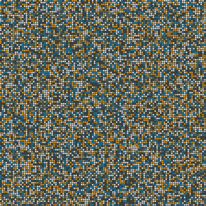](videos/rps_random.mp4)

**[Random start](videos/rps_random.mp4).** The same rules starting from a random board.

```
python3 main.py vonNeumann rules/rps.txt boards/rps_random.csv output/rps_random 5 300 color_maps/rps.txt
```

[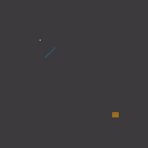](videos/rps_clusters.mp4)

**[Clusters](videos/rps_clusters.mp4).** The same rules starting from a few small clusters; watch which one takes over.

```
python3 main.py vonNeumann rules/rps.txt boards/rps_clusters.csv output/rps_clusters 5 180 color_maps/rps.txt
```

[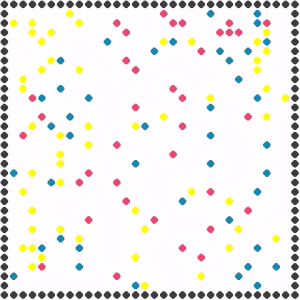](videos/rps_bounce.mp4)

**[Bounce](videos/rps_bounce.mp4).** A variant with its own rules: rock, paper, and scissors particles bounce around a walled box, and the winners of each collision survive.

```
python3 main.py vonNeumann rules/rps_bounce.txt boards/rps_bounce.csv output/rps_bounce 15 200 color_maps/rps_bounce.txt
```

## Crystal growth

Based on a research paper, this automaton grows a crystal outward from a small seed.

[](videos/crystal_growth_1.mp4)

**[Seed 1](videos/crystal_growth_1.mp4).**

```
python3 main.py Moore rules/crystal_growth.txt boards/crystal_growth_1.csv output/crystal_growth_1 5 80 color_maps/crystal_growth.txt
```

[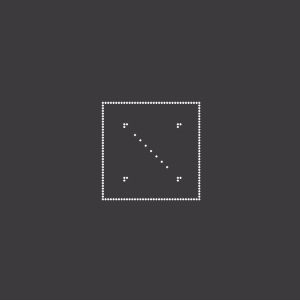](videos/crystal_growth_2.mp4)

**[Seed 2](videos/crystal_growth_2.mp4).** The same rules from a different seed.

```
python3 main.py Moore rules/crystal_growth.txt boards/crystal_growth_2.csv output/crystal_growth_2 5 60 color_maps/crystal_growth.txt
```

## BML traffic

A classic traffic model: blue cars try to move up and orange cars try to move right, and a car waits whenever the cell ahead of it is occupied. Depending on how crowded the city is, traffic either flows freely or jams for good.

[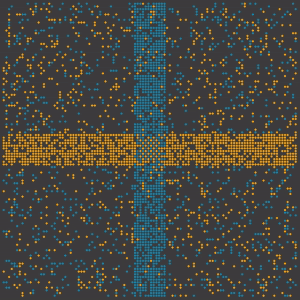](videos/bml_traffic_random.mp4)

**[Random start](videos/bml_traffic_random.mp4).**

```
python3 main.py vonNeumann rules/bml_traffic.txt boards/bml_traffic_random.csv output/bml_traffic_random 5 400 color_maps/bml_traffic.txt
```

[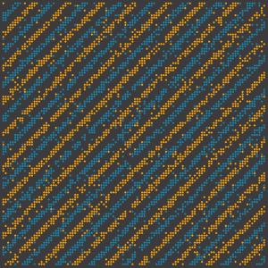](videos/bml_traffic_diagonal.mp4)

**[Diagonal start](videos/bml_traffic_diagonal.mp4).**

```
python3 main.py vonNeumann rules/bml_traffic.txt boards/bml_traffic_diagonal.csv output/bml_traffic_diagonal 5 400 color_maps/bml_traffic.txt
```

[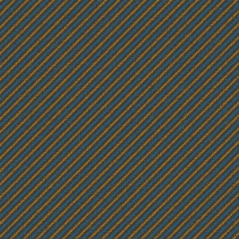](videos/bml_traffic_large.mp4)

**[Large city](videos/bml_traffic_large.mp4).** A 512 by 512 board. Keep the cell width at 3 or more here: below that, the cars are drawn too small to see.

```
python3 main.py vonNeumann rules/bml_traffic.txt boards/bml_traffic_large.csv output/bml_traffic_large 3 300 color_maps/bml_traffic.txt
```

## Predator-prey

Predators eat prey, and prey reproduce and swim away, producing waves of activity until the system burns out. This model is related to the chapter's practice exercises.

[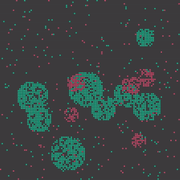](videos/predator_prey.mp4)

**[Clusters](videos/predator_prey.mp4).**

```
python3 main.py Moore rules/predator_prey.txt boards/predator_prey.csv output/predator_prey 5 270 color_maps/predator_prey.txt
```

[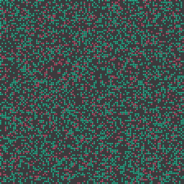](videos/predator_prey_random.mp4)

**[Random start](videos/predator_prey_random.mp4).**

```
python3 main.py Moore rules/predator_prey.txt boards/predator_prey_random.csv output/predator_prey_random 5 290 color_maps/predator_prey.txt
```

## Langton's ant

[](videos/langtons_ant.mp4)

**[Langton's ant](videos/langtons_ant.mp4).** An ant turns right on a white cell and left on a black one, flips the color of the cell, and steps forward. The color map is required because the ant uses more states than the default color map covers.

```
python3 main.py vonNeumann rules/langtons_ant.txt boards/langtons_ant.csv output/langtons_ant 10 400 color_maps/langtons_ant.txt
```

## Wireworld

Wireworld models electronic circuits: electrons (a head followed by a tail) travel along wires.

[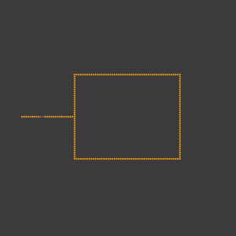](videos/wireworld.mp4)

**[Loop](videos/wireworld.mp4).** An electron travels down a wire into a loop, splits in two, and the two halves cancel out when they meet on the far side.

```
python3 main.py Moore rules/wireworld.txt boards/wireworld.csv output/wireworld 5 110 color_maps/wireworld.txt
```

[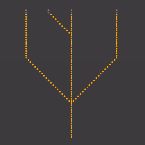](videos/wireworld_nae.mp4)

**[Branching wires](videos/wireworld_nae.mp4).** Signals travel along a set of branching wires.

```
python3 main.py Moore rules/wireworld.txt boards/wireworld_nae.csv output/wireworld_nae 10 50 color_maps/wireworld.txt
```

## Checkerboard

[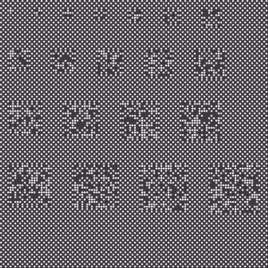](videos/checkerboard.mp4)

**[Checkerboard](videos/checkerboard.mp4).** A checkerboard with noisy patches settles down within a few generations, leaving only the outlines of the patches.

```
python3 main.py Moore rules/checkerboard.txt boards/checkerboard.csv output/checkerboard 5 20 color_maps/checkerboard.txt
```
