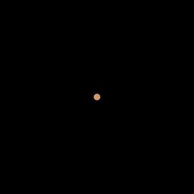
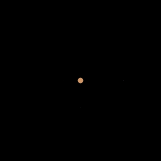
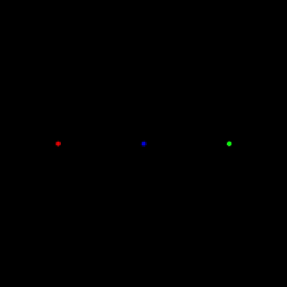
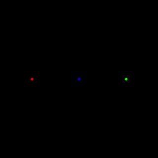
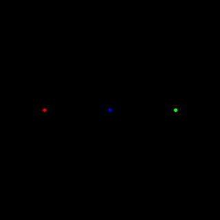
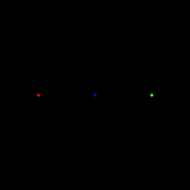

# Gravity simulator gallery

Every video below comes from the gravity simulator that we built in class. Only the starting universe in `data/` and the command-line arguments change. Click a preview (or a name) to watch the full video on GitHub; the videos are in the `videos/` folder.

To make any of these yourself, open a terminal in `python/src/gravity` and run the command shown. Use `python` instead of `python3` on Windows. The video appears in `output/`, named after the scenario, so a new run of the same scenario replaces the old video. The arguments are, in order: the scenario (a file in `data/`, without `.txt`), the number of generations, the time step in seconds, the canvas width in pixels, and the drawing frequency (we draw one frame every this many generations).

## Jupiter's moons

Jupiter and its four largest moons (Io, Europa, Ganymede, and Callisto), with their real masses, distances, and speeds, and the real gravitational constant.

[](videos/jupiter_moons.mp4)

**[Jupiter's moons](videos/jupiter_moons.mp4).** The run from the code along: 1,000 one-minute steps, or about 17 hours. That is not even half of one orbit of Io, the fastest moon.

```
python3 main.py jupiter_moons 1000 60 1500 10
```

[](videos/jupiter_moons_17_days.mp4)

**[Seventeen days](videos/jupiter_moons_17_days.mp4).** The same system for 25,000 one-minute steps (about 17 days), long enough for every moon to complete an orbit: Io takes 1.8 days, Europa 3.6, Ganymede 7.2, and Callisto 16.7.

```
python3 main.py jupiter_moons 25000 60 1500 100
```

[](videos/jupiter_double_g.mp4)

**[Gravity doubled](videos/jupiter_double_g.mp4).** The code along suggests changing the gravitational constant. Here we double it: open `data/jupiter_moons.txt`, change its second line from `6.67408e-11` to `1.334816e-10`, and run the 17-day command again. Each moon is now going too slowly for a circular orbit, so it falls inward and loops around Jupiter on a stretched ellipse. Change the line back when you are done.

```
python3 main.py jupiter_moons 25000 60 1500 100
```

[](videos/jupiter_half_g.mp4)

**[Gravity halved](videos/jupiter_half_g.mp4).** The same experiment with the second line changed to `3.33704e-11`. With gravity halved, each moon is moving at exactly escape speed, so all four fly away from Jupiter for good.

```
python3 main.py jupiter_moons 25000 60 1500 100
```

## Three-body choreographies

Three equal masses, with the gravitational constant set to 1, started from carefully chosen positions and velocities so that they trace a repeating pattern. The figure-eight was found by Cris Moore in 1993; the others are among the periodic orbits found by Milovan Šuvakov and Veljko Dmitrašinović in 2013. Each of these takes about a minute to run.

[](videos/figure_eight.mp4)

**[Figure-eight](videos/figure_eight.mp4).** All three bodies chase each other around a single figure-eight.

```
python3 main.py figure_eight 100000 0.0001 1500 300
```

[](videos/butterfly.mp4)

**[Butterfly](videos/butterfly.mp4).**

```
python3 main.py butterfly 100000 0.0001 1500 300
```

[](videos/dragonfly.mp4)

**[Dragonfly](videos/dragonfly.mp4).**

```
python3 main.py dragonfly 100000 0.0001 1500 300
```

[](videos/goggles.mp4)

**[Goggles](videos/goggles.mp4).**

```
python3 main.py goggles 100000 0.0001 1500 300
```

[](videos/moth.mp4)

**[Moth](videos/moth.mp4).**

```
python3 main.py moth 100000 0.0001 1500 300
```

[](videos/yarn.mp4)

**[Yarn](videos/yarn.mp4).**

```
python3 main.py yarn 100000 0.0001 1500 300
```

## High resolution

Ten times as many generations with a time step ten times smaller: the same stretch of time, simulated more accurately, with smoother trails. These runs are much slower and need a lot of memory (around 15 GB), because our simulator keeps every generation of the universe in a list; if your computer struggles, stick to the versions above. Most of these look just like the versions above, which is a good sign that the simulation is accurate. The exception is goggles, a sensitive orbit whose shape visibly changes when we simulate it more accurately.

[](videos/figure_eight_hires.mp4)

**[Figure-eight, high resolution](videos/figure_eight_hires.mp4).**

```
python3 main.py figure_eight 1000000 0.00001 1500 3000
```

[](videos/butterfly_hires.mp4)

**[Butterfly, high resolution](videos/butterfly_hires.mp4).**

```
python3 main.py butterfly 1000000 0.00001 1500 3000
```

[](videos/dragonfly_hires.mp4)

**[Dragonfly, high resolution](videos/dragonfly_hires.mp4).**

```
python3 main.py dragonfly 1000000 0.00001 1500 3000
```

[](videos/goggles_hires.mp4)

**[Goggles, high resolution](videos/goggles_hires.mp4).**

```
python3 main.py goggles 1000000 0.00001 1500 3000
```

[](videos/moth_hires.mp4)

**[Moth, high resolution](videos/moth_hires.mp4).**

```
python3 main.py moth 1000000 0.00001 1500 3000
```

[](videos/yarn_hires.mp4)

**[Yarn, high resolution](videos/yarn_hires.mp4).**

```
python3 main.py yarn 1000000 0.00001 1500 3000
```
